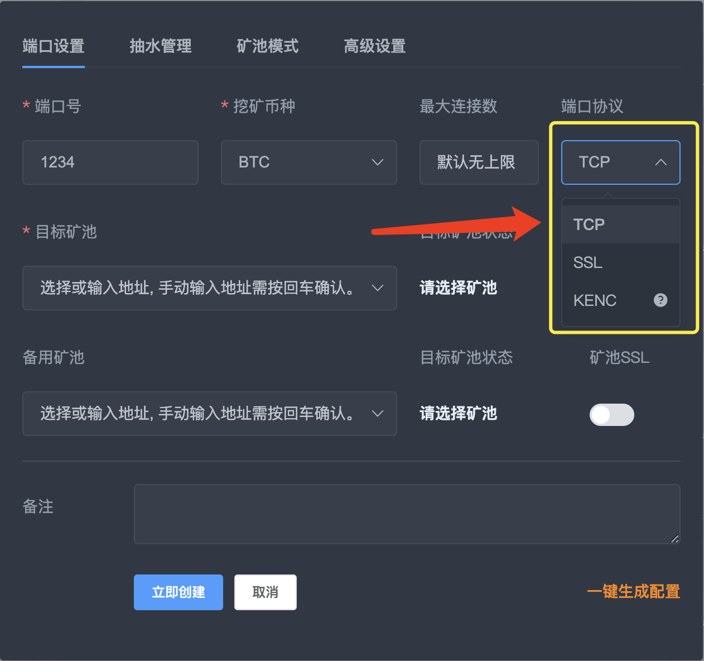
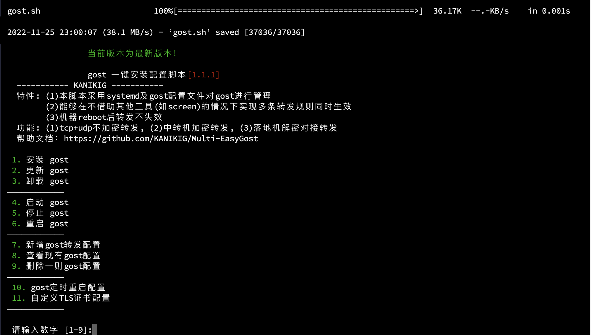
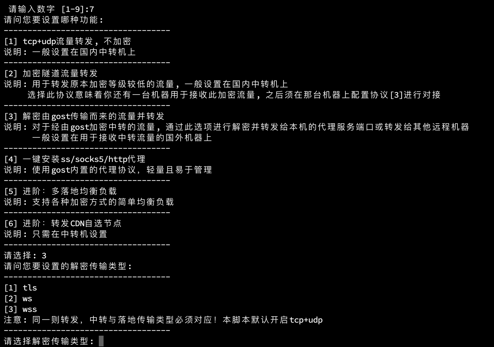
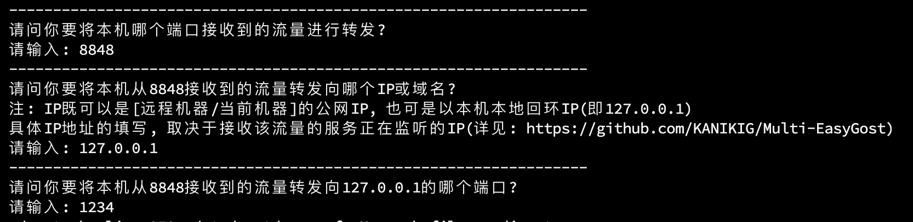

<h1>此文档描述了如何使用GOST工具接入KT</h1>

<pre>
以下所有教程基于<a href="https://github.com/ginuerzh/gost/releases/tag/v2.11.2">gost v2.11.2</a>版本编写, 切勿使用不同版本。

windows-amd64下载地址: <a href="https://github.com/ginuerzh/gost/releases/download/v2.11.2/gost-windows-amd64-2.11.2.zip">https://github.com/ginuerzh/gost/releases/download/v2.11.2/gost-windows-amd64-2.11.2.zip</a>

其他架构下载地址: <a href="https://github.com/ginuerzh/gost/releases/tag/v2.11.2">其他架构(页面打开后拉至最下方)</a>
</pre>

 
<h2>
1. 服务器端使用KT建立协议为tcp的端口, 用来接收gost发送过来的解密数据。
</h2>

(这里以KT端口为1234举例。)

 
<h2>
2. 服务器端运行以下命令来安装、配置gost接收端
</h2>
<pre>
wget --no-check-certificate -O gost.sh https://raw.githubusercontent.com/KANIKIG/Multi-EasyGost/master/gost.sh && chmod +x gost.sh && ./gost.sh</pre>

运行完毕后, 可以看到如下菜单

<h3>选择[1]安装, 等待安装完毕后, 重新运行命令调出菜单,选择[7]新增gost转发配置。</h3>

<h3>选择[3]解密由gost传输而来的流量并转发, 可看到如下界面</h3>

<h3>此处选择[1], 以tls解密为例子, (后续可以自行阅读官方文档, 使用ws或wss方式进行解密。)</h3>
<h3>此时要输入本机接收端口, 随便填一个没有被占用的端口号, 此处使用8848作为gost的接收端口。</h3>
<h3>接下来要输入转发到目标的ip地址, 如果gost和kt在同一台服务器, 此处填写127.0.0.1即可, 相当于gost将解密的数据发送给本机</h3>
<h3>然后需要填写接收到的流量转发给哪个端口, 这个端口填写刚刚kt里配置的端口号1234, 至此服务端配置完毕。</h3>

 
<h2>
3. 客户端部署gost用来发送数据给服务器端
</h2>
<h3>本教程客户端将使用windows环境来部署, linux或其他客户端环境随后再写。</h3>
<h3>
解压windows版本的gost压缩包，打开文件夹之后, 在文件夹内新建一个文本文档, 后缀名改为.bat, 将一下内容修改粘贴进去
</h3>
<pre>
@echo off
%~dp0gost-windows-amd64.exe -L=tcp://:18899 -F relay+tls://服务器ip:8848
pause
</pre>
<h3>
18899可以修改为任意不被占用的端口, 服务器ip修改为运行服务器即可, 后面的8848是教程前面服务器上设置的接收端口, 如果这个修改这个端口, 那么请连带服务器的端口一同修改
</h3>
<h3>
然后就可以双击启动这个.bat后缀的文件了
</h3>

<h3>
启动成功后, 可以看到如上提示, 此时这台电脑同局域网下的所有矿机，即可接入这台电脑的gost，这里假如现在这台电脑的局域网ip为192.168.1.8, 那么所有局域网内的矿机采矿地址填写为 stratum+tcp://192.168.1.8:18899 即可
</h3>
