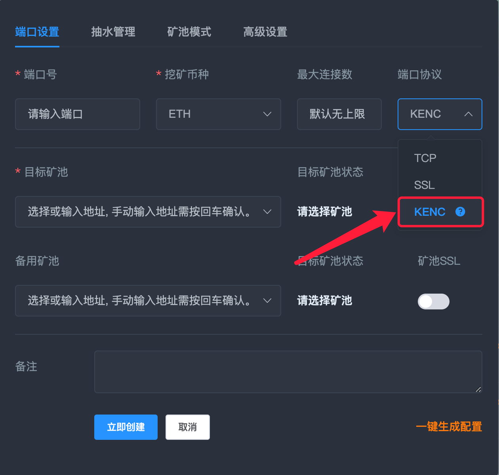
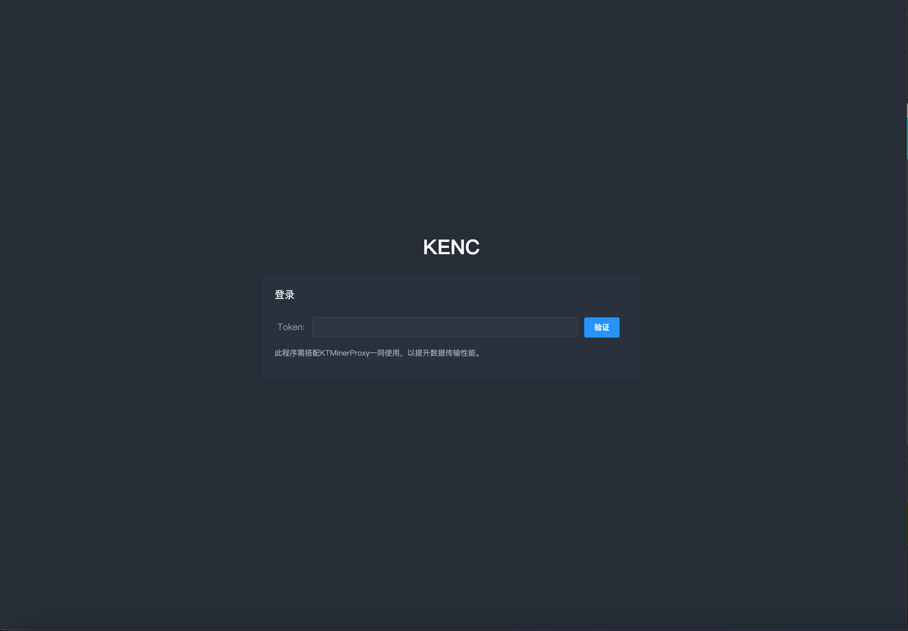
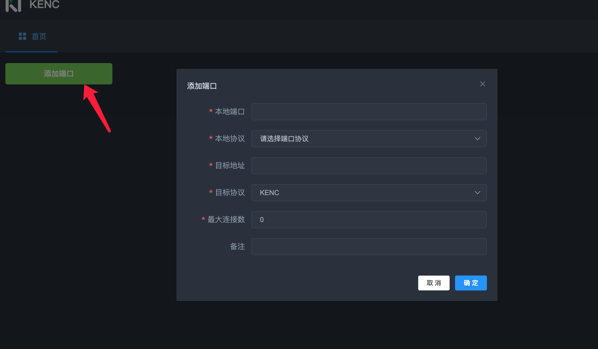
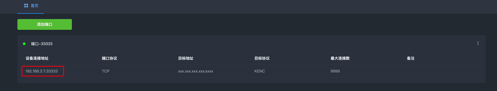

<div align="center">

# KENC文档说明

</div>

<p id="kenc"></p>

### KENC是本地->远程KT隧道，局域网部署在一台设备上即可，可与远程KTMinerProxy通过KENC协议进行通信。

<a href="https://github.com/kt007007/KTMinerProxy/raw/main/KENC/kenc_v_win.exe">点击下载WINDOWS客户端</a>

<a href="https://github.com/kt007007/KTMinerProxy/raw/main/KENC/kenc_v_win.exe">点击下载LINUX客户端</a>

### 使用环境
```
KTMinerproxy版本>=2.1.0
```

## 使用说明

### 1.远程ktminerproxy先配置一个KENC协议的端口



### 2.本地找一台电脑运行KENC, 运行成功后会提示, 根据提示访问地址去配置自己的KENC客户端


### 3. 打开网页kenc客户端, 默认密码admin123



### 4. 添加本地端口



<ul>
    <li>先随便填写个本地端口 小于65535的数字</li>
    <li>本地协议选择TCP或SSL，选择采矿设备支持的协议即可</li>
    <li>目标地址填写远程的KTMinerproxy的连接地址，链接地址为远程ip:端口号</li>
    <li>最大连接数默认无上限</li>
</ul>

### 5. 局域网的所有采矿设备的连接地址填写局域网安装KENC的设备IP地址+本地端口号即可, 通常直接连接图内地址即可

