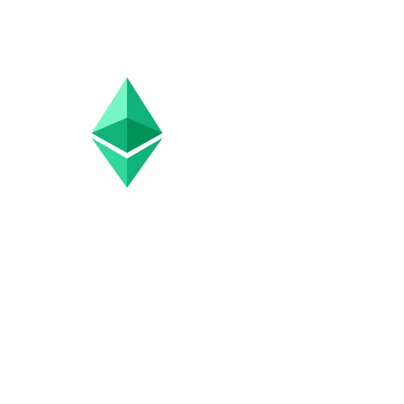
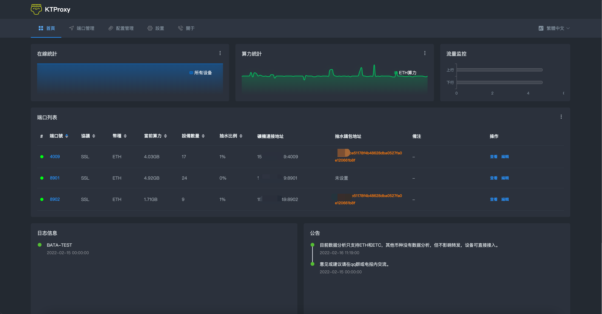
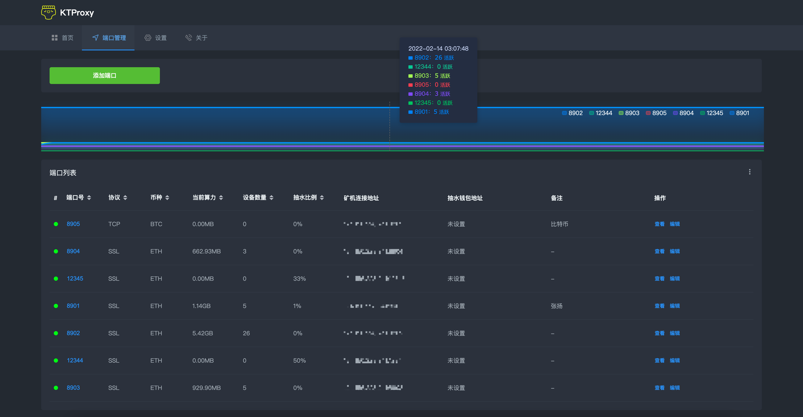
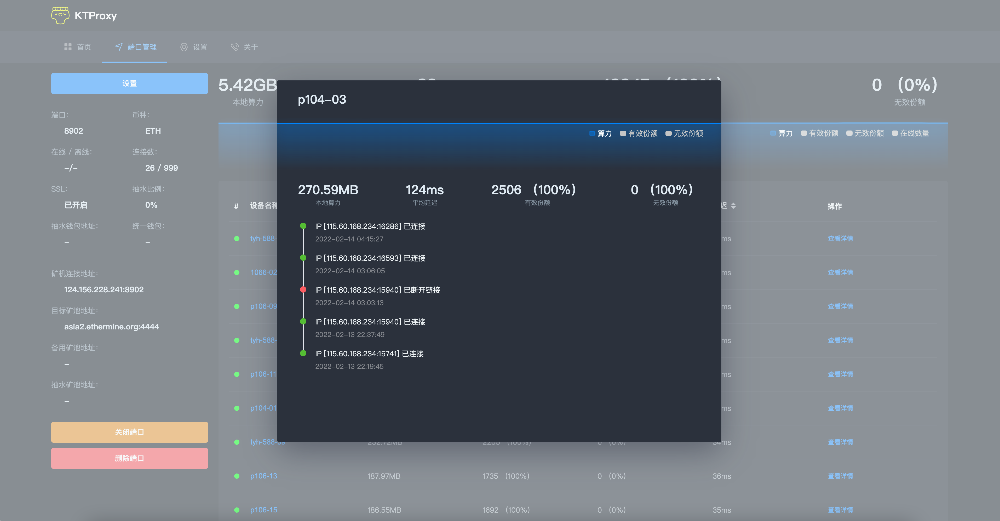

<div id="top"></div>

<!-- PROJECT LOGO -->
<div align="center">

# KTMinerProxy

  <a href="https://github.com/kt007007/KTMinerProxy">
    
  </a>

[![Contributors][contributors-shield]][contributors-url]
[![Forks][forks-shield]][forks-url]
[![Stargazers][stars-shield]][stars-url]
[![Issues][issues-shield]][issues-url]


  <p align="center">
    一款免费且功能强大的矿池加速软件, 现已开启内侧。
    <br />
    <a href="https://kdocs.cn/l/slPG1q488Trc"><strong>帮助文档 »</strong></a>
    <br />
    <br />
    <a href="https://qm.qq.com/cgi-bin/qm/qr?k=2qOW3S0PnHGL_30AmNmLLRDp2bhwIi3M&jump_from=webapi">QQ群: 978113445</a>
    ·
    <a href="https://t.me/+VK7ZOlKvcLljYjQ1"> 电报 https://t.me/+VK7ZOlKvcLljYjQ1</a>
  </p>
</div>

# 简介

<p id="about-the-project">KTMinerProxy是一款功能强大的矿池加速程序, 目前程序处于内侧阶段, 意见和建议请提交至issue、qq群或电报, 我们会及时处理。

# 导航
<ol>
<li>
    <a href="#about-the-project">简介</a>
</li>
<li>
    <a href="#gn">功能</a>
</li>
<li>
    <a href="#preview">软件预览</a>
</li>
<li>
    <a href="#install">部署软件</a>
    <ul>
    <li><a href="#linux">Linux</a></li>
    <li><a href="#windows">Windows</a></li>
    </ul>
</li>
<li><a href="#about">免责声明</a></li>
<li><a href="#about">联系我们</a></li>
</ol>

# 功能

KTMinerProxy采用GO语言原创编写, 有着高并发性能优势的同时, 还具备了强大的功能。
<div align="center" id="gn">
<table>
    <tr>
        <td>支持的功能</td>
        <td>支持的币种</td>
    </tr>
    <tr>
        <td>
            * 数据统计分析<br>
            * TLS/SSL加密<br>
            * 矿池转发<br>
            * 预置各币种的矿池（随时更新）<br>
            * 自定义矿池<br>
            * 备用矿池<br>
            * 自定义端口<br>
            * 端口连接数限制<br>
            * 自定义抽水比例<br>
            * 自定义抽水钱包、矿池、设备名称<br>
            * 统一钱包<br>
            * 矿池模式<br>
            * 端口备注<br>
            * 在线更新<br>
            * 内置进程守护<br>
            * 导入导出端口配置<br>
            * 自定义SSL密钥<br>
            * 堕多地区语言<br>
            * .......<br><br><br>
        </td>
        <td>
            * ETH<br>
            * ETC<br>
            * BTC<br>
            * KDA<br>
            * ZEC<br>
            * BEAM<br>
            * RVN<br>
            * ERG<br>
            * ZEN<br>
            * LTC<br>
            * DCR<br>
            * DASH<br>
            * CKB<br>
            * BCH<br>
            * HNS<br>
            * STC<br>
            * 陆续添加中......<br><br><br><br><br>
        </td>
    </tr>
</table>
</center>
</div>

</p>

<!-- ABOUT THE PROJECT -->
<p id="preview"></p>

# 软件预览




<table>
    <tr>
        <td>
            <center>
                
            </center>
        </td>
        <td>
            <center>
                
            </center>
        </td>
    </tr>
</table>

<hr>


上述币种皆可支持转发, 部分币种暂不支持配置抽水, 后续会陆续更新。

目前内侧阶段无抽水, 公测时通过投票决定计费方式。
<p align="right">(<a href="#top">back to top</a>)</p>


<!-- GETTING STARTED -->
<p id="install"></p>

# 开始使用

部署之前, 您需要有一台自己的云服务器来部署此软件, 服务器选择方案点击此处查看帮助。<br>
云服务器请打开16777端口, 默认web访问地址为此端口。<br>


<p id="linux"></p>

# Linux

### 安装:
```
bash <(curl -s -L https://raw.githubusercontent.com/kt007007/KTMinerProxy/main/linux-install.sh)
```

### 卸载:
```
bash <(curl -s -L https://raw.githubusercontent.com/kt007007/KTMinerProxy/main/linux-install.sh) -uninstall
```

### 停止服务:
```
bash <(curl -s -L https://raw.githubusercontent.com/kt007007/KTMinerProxy/main/linux-install.sh) -stop
```

### 启动服务:
```
bash <(curl -s -L https://raw.githubusercontent.com/kt007007/KTMinerProxy/main/linux-install.sh) -start
```

### 重启服务:
```
bash <(curl -s -L https://raw.githubusercontent.com/kt007007/KTMinerProxy/main/linux-install.sh) -restart
```

支持的Linux

* Ubuntu 64 18.04+
* Centos 64 7+

<p id="windows"></p>

# Windows
下载完后直接启动即可，程序自带进程守护

<a href="https://github.com/kt007007/KTMinerProxy/tree/main/Windows-64">下载地址</a>


<p align="right">(<a href="#top">back to top</a>)</p>

<!-- CONTACT -->
<p id="about"></p>

# 免责声明
<p id="flsm">不支持大陆区域的安装，请遵守法当地律法规, 使用此软件造成的法律问题, 一概与软件作者无关。</p>


# 联系我们

QQ群: [978113445](https://qm.qq.com/cgi-bin/qm/qr?k=2qOW3S0PnHGL_30AmNmLLRDp2bhwIi3M&jump_from=webapi)

电报: [https://t.me/+VK7ZOlKvcLljYjQ1](https://t.me/+VK7ZOlKvcLljYjQ1)

<p align="right">(<a href="#top">back to top</a>)</p>


[contributors-shield]: https://img.shields.io/github/contributors/kt007007/KTMinerProxy.svg?style=for-the-badge
[contributors-url]: https://github.com/kt007007/KTMinerProxy/graphs/contributors
[forks-shield]: https://img.shields.io/github/forks/kt007007/KTMinerProxy.svg?style=for-the-badge
[forks-url]: https://github.com/kt007007/KTMinerProxy/network/members
[stars-shield]: https://img.shields.io/github/stars/kt007007/KTMinerProxy.svg?style=for-the-badge
[stars-url]: https://github.com/kt007007/KTMinerProxy/stargazers
[issues-shield]: https://img.shields.io/github/issues/kt007007/KTMinerProxy.svg?style=for-the-badge
[issues-url]: https://github.com/kt007007/KTMinerProxy/issues
[license-shield]: https://img.shields.io/github/license/kt007007/KTMinerProxy.svg?style=for-the-badge