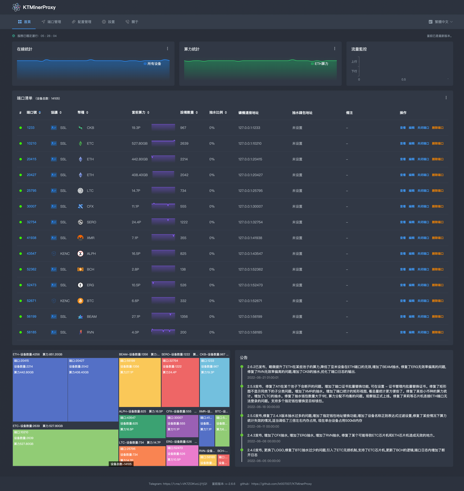
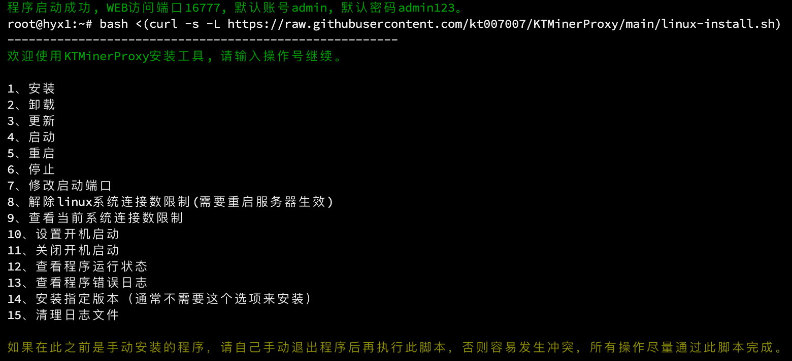
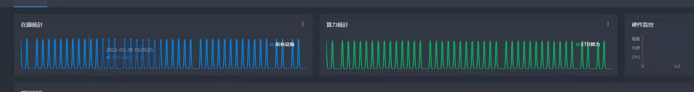
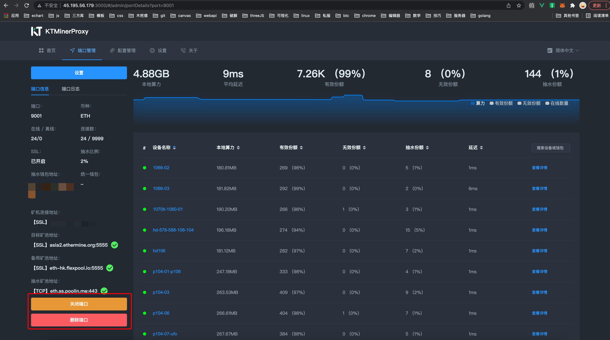
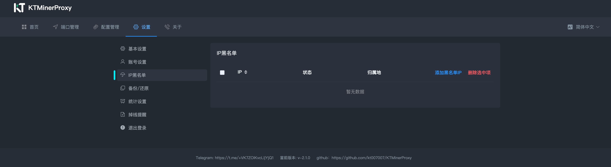

<div id="top"></div>

<!-- PROJECT LOGO -->
<div align="center">


<br>

[![Contributors][contributors-shield]][contributors-url]
[![Forks][forks-shield]][forks-url]
[![Stargazers][stars-shield]][stars-url]
[![Issues][issues-shield]][issues-url]

<a href="https://github.com/kt007007/KTMinerProxy">English</a>｜<a href="https://github.com/kt007007/KTMinerProxy/tree/main/Readme/hk">繁体中文</a>

<h1>
🔥🔥🔥 体验全新KT3.0, 更名为（RustMinerSystem）🔥🔥🔥

项目地址
    <a href="https://github.com/EvilGenius-dot/RustMinerSystem">https://github.com/EvilGenius-dot/RustMinerSystem</a>
</h1>
<h2>
KTMinerProxy已停止维护， 但依旧可用， 如需获得更强大功能及精准的BTC、LTC等抽水，请使用<a href="https://github.com/EvilGenius-dot/RustMinerSystem">RustMinerSystem</a>。 KT及RustMinerSystem出自同一团队, 请放心使用。
</h2>

<p>
Professional mine operation and maintenance tools, improve mine profits, detect abnormalities in mines and nodes, and become the best assistant of mines. (this software is only for use in legally licensed areas. If you use this software, it means that you accept this license by default. If you use it in a restricted area, you should bear the legal problems caused by it.)
</p>
<h3>
    The original tg account was stolen, please add a new group

    原先tg账号被盗，请添加加新群组，谨防诈骗。
    
   <h3> The original account is lost and not operated by myself since February 26. Beware of fraud and new group links https://t.me/ +7kmdb-SRwXMxYmFl. Please forward it to each other in a large group. Recently, TG should have a certain vulnerability. Recently, a large number of accounts have been stolen. Pay attention to prevention. When adding strangers, do not display account information and send screenshots, otherwise they will be stolen. Be careful of new vulnerabilities
   
</h3>
   <h3>
        Telegram：<a href="https://t.me/rustkt">https://t.me/rustkt</a>
    </h3>

</div>
<!-- <h1></h1> -->
<!-- <h2>简介</h2> -->
<h1>KTMinerProxy</h1>
<p>:zap: Original and genuine, powerful and powerful. Support lossless BTC ETC ETH LTC ERG CFX RVN SERO XMR CKB BEAM ALPH KASPA DCR FLUX NEOX and other currency pumping, no memory burst, experience full, 9000 units without pressure and no collapse, accurate to 24-hour data statistics of a single device , custom tunnel push tool and other powerful functions...</p>

<p align="center">
    
  </p>

<h2>One-click toolbox for Linux</h2>
<p>The root user directly executes the following commands, and selects the corresponding function according to the prompts.</p>

```
bash <(curl -s -L https://raw.githubusercontent.com/kt007007/KTMinerProxy/main/linux-install.sh)
```

<h2>Disclaimer</h2>
<p>This software is only for use in areas permitted by law. If you use this software, it means that you accept this license by default. If you use it in restricted areas, you will be responsible for legal problems.</p>

# catalogue

<ol>
<li>
    <a href="#uplog">Changelog</a>
</li>
<li>
    <a href="#gn">Function </a>
</li>
<li>
    <a href="#install">Deploy software</a>
    <ul>
        <li>
            <a href="#linux">Linux</a>
            <ul>
                <li>
                    <a href="#linux">Install</a>
                </li>
                <li>
                    <a href="#linux">renew</a>
                </li>
                <li>
                    <a href="#linux">uninstall</a>
                </li>
                <li>
                    <a href="#linux">Out of service</a>
                </li>
                <li>
                    <a href="#linux">start the service</a>
                </li>
                <li>
                    <a href="#linux">restart the service</a>
                </li>
                <li>
                    <a href="#linux">boot</a>
                </li>
                <li>
                    <a href="#linux">Set the maximum number of connections</a>
                </li>
                <li>
                    <a href="#linux">View program runtime log</a>
                </li>
            </ul>
        </li>
        <li>
            <a href="#windows">Windows</a>
        </li>
        <li>
            <a href="#_kenc">Local encryption client KENC</a>
        </li>
    </ul>
</li>
<li>
    <a href="#about">common problem</a>
    <ul>
        <li>
            <a href="#q15">memory related</a>
        </li>
        <li>
            <a href="#q0">process daemon</a>
        </li>
        <li>
            <a href="#q1">Default account password</a>
        </li>
        <li>
            <a href="#q1">Computing power is wavy</a>
        </li>
        <li>
            <a href="#q2">load balancing</a>
        </li>
        <li>
            <a href="#q3">prompt when installing curl: command not found</a>
        </li>
        <li>
            <a href="#q4">Modify the port to start</a>
        </li>
        <li>
            <a href="#q5">change Password</a>
        </li>
        <li>
            <a href="#q6">Prompt at startup dial tcp connection refused</a>
        </li>
        <li>
            <a href="#q7">close/delete port</a>
        </li>
        <li>
            <a href="#q8">Prompt during installation: Install killall failed! ! ! ! Please install psmisc manually before executing the installer。</a>
        </li>
        <li>
            <a href="#q9">WEB access is stuck in the LOADING interface for a long time.</a>
        </li>
        <li>
            <a href="#q11">IP blacklist</a>
        </li>
        <li>
            <a href="#q12">ETH, ETC chip machine</a>
        </li>
        <li>
            <a href="#q18">Innosilicon A11 series related issues</a>
        </li>
        <li>
            <a href="#q13">Local computing power modification</a>
        </li>
        <li>
            <a href="#q14">migrate</a>
        </li>
        <li>
            <a href="#q10">Development costs and loss of computing power</a>
        </li>
        <li>
            <a href="#q16">watcher link</a>
        </li>
        <li>
            <a href="#q17">Common reasons for insufficient computing power</a>
        </li>
    </ul>
</li>
<li><a href="#about">Disclaimer</a></li>
<li><a href="#about">contact us</a></li>
</ol>

<span id="gn"></span>
### Core functions

- Full currency non-destructive pumping
- Advanced memory management mechanism, up to 8,000 single machines have been running stably so far
- 24-hour statistical analysis of data accurate to a single device
- TLS/SSL/KENC encryption
- Supporting local encryption tools
- Preset various currency mining pools (update at any time)
- Soft anti cc
- Multi-wallet configuration
- Replace the specified wallet
- Unified wallet
- Mining pool mode
- Quickly import and export all configurations
- Modify the local computing power in the mining pool
- IP blacklist
- Custom RSA encryption key
- Custom certificates
- custom configuration
- Drop reminder
- The same watcher address as the mining pool official website
- Ultra-low handling fee

### Coins that already support pumping (if you need to add a new currency, please contact the administrator in the telegram, usually it can be completed within one day)

- BTC
- ETC
- ETH
- LTC
- ERG
- CFX
- RVN
- SERO
- XMR
- CKB
- BEAM
- ALPH
- KASPA
- DCR
- FLUX
- NEOX
- RXD
- MEOW
- LBC
- CTXC
- HNS
- ALEO
- DNX
- ...

<span id="uplog"></span>
# Changelog

```
2.9.8
Fixed several issues with kaspa

2.9.7
Added NEXA currency

2.9.6
Added DNX currency

2.9.5
Added ALEO currency

2.9.2
[Important update] Fixed the problem that the device would disconnect every time it works

2.9.0
Add meox currency (based on T-rex kernel test, if the certificate does not match, append --no-strict-ssl after the kernel startup command)
Add ctxc currency (based on gminer test)
Fix the problem that ckb, erg, flux, hns, lbc, neox, rvn may be invalid in some cases

2.8.9
Fixed ETHW hashrate display issue
Fixed the problem that KASPA reported an error under bzminer

2.8.8
Added ETF and chipset
Add ETHW and chipset

2.8.7
Fix the problem of excessive pumping due to anti-cheating bug

2.8.6
Fixed a bug that caused the software to crash for some small currencies
Added LBC
Added HNS

2.8.5
Added NEOX currency

2.8.4
FLUX can now be in lossless mode (gminer is recommended)

2.8.3
FLUX (compatibility mode) supported
Fixed a bug in the display of the hashrate chart on the home page in some cases
Added the display of the core or model of the chip machine

2.8.2
Fixed ETC devices appearing in wallets where they shouldn't be

2.8.1
Add hardware monitoring
Added watcher address to close the fee option
Add the log of sensitive operations, the log will be displayed in the original position of the announcement

2.8.0
[Important Update] [Security Update]
Fixed a serious security vulnerability, remember to modify the [account] and [password] after the update

2.7.9
Added dcr pumping (compatibility mode)
Optimized a possible error in etc, kaspa, bch, erg

2.7.8
Added the modification of the pumping ratio for a certain device
Added alternate pumping address

2.7.7
Fixed the problem of some columns of erg
Optimized the display of the number of online/offline devices

2.7.6
Fixed the issue that kaspa high was invalid

2.7.5
Added pure forwarding port, similar to nginx
Added share last commit date
Optimized page details and themes

2.7.4
[Important Update] Fixed a bug where custom certificates would be automatically restored, affecting 2.6.x-2.7.3

2.7.3
Optimized for new layouts and themes

2.7.2
Added new layouts and themes

2.7.1
Machines with the same name from different wallets are now displayed separately
Added a custom RSA key for the KENC port (this function is only suitable for making a client by yourself, usually do not configure it, otherwise the kenc port will not be able to connect normally)

2.7.0
Fixed the problem that KASPA was invalid too high

2.6.9
Increased KASPA's pumping

2.6.8
Fixed an issue where custom configurations for several currencies could not be found when creating ports
Fixed an issue that caused the software to crash when mining XMR
Improved program stability

2.6.7
Added XMR computing power statistics
Added ERG computing power statistics
Added RVN computing power statistics
Added error message that the kernel does not match the certificate
Optimized XMR logs
Fixed an issue with XMR multiple devices merging

2.6.6
Fixed the problem that ALPH was invalid too high
Fixed a place where ETC generation could be invalid
Modified the introduction of some currencies when adding ports

2.6.5
The push address of kenc is changed to an encrypted address. The encrypted address is only supported by the latest version of the kenc client. If this function is required, you need to download the kenc client and the 2.6.5 KT client again.
Optimized logging of device details
Optimized the login interface

2.6.4
Increased ALPH pumping

2.6.3
Fixed the problem that BEAM pumping was too high

2.6.2
[IMPORTANT UPDATE]
Slightly increased ETH hashrate in some pools
Reduced the invalidation of Yami devices on the ETH port
Added BEAM pumping

2.6.1
Fixed the problem of high inefficiency of ERG
Fixed the problem of high inefficiency of RVN

2.6.0
Added CKB pumping
Optimized the output of the port log

2.5.9
Fixed an issue where A11 would disconnect under a certain pool
Added port certificate batch replacement function, you can batch replace certificates in Settings - Certificate Management
Fixed the problem that the rectangular chart does not display subcategories under the same category

2.5.8
Increased pumping of XMR

2.5.7
Added a rectangular view of port statistics, making it easier to see total statistics
Fixed hashrate statistics for some small coins

2.5.6
Increased pumping for LTC

2.5.5
Increase SERO coin margin
Implemented all computing power statistics that support small currency pumping

2.5.4
Fixed the problem of uneven distribution of computing power when the number of pumping wallets is greater than 1

2.5.3
Added observer link, edit port - advanced settings to open this function

2.5.2
Fixed the problem that chip machines such as Jasmine could not log in when connected to the ETH port
Appropriately increased the memory usage a little bit to reduce the probability of invalidation

2.5.1
Support multiple designated wallets to replace to the target wallet
Fixed the bug that ETC chip machine A11 and some small currencies may not work properly in lossless mode

2.5.0
Fixed the problem of excessive pumping in version 2.4.X
Added the function of replacing the specified wallet address
Added device name regex filter setting
Fixed a situation where the hashrate statistic would not work in some cases
Appropriately lowered the memory usage by about three times, and now a single device occupies 500kB memory

2.4.3
Added CFX rake
Added ERG pumping
Added RVN pumping
Fixed a place where ETC chip machine and ETH chip machine could be invalid

2.4.2
Added support for nicehash

2.4.1
Fixed ETC chip machine related issues

2.4.0
Changed the logo
Fixed the problem of too little BTC pumping
Introduced ETC lossless mechanism
Support ETC chip machine
Updated the logic of BCH
Added disconnection log to port log

2.3.3
Perfect A11

2.3.2
Added compatibility mode, you can try to use this mode when some currencies or models are invalid after working for a period of time and cannot continue to work
Optimized for BTC, BTC models and mining pools that cannot be pumped can use compatibility mode to work
Optimized for A11, if it is an A11 machine, please select ETH chip level and lossless mode for the port
Updated KENC, all users who use KENC client please download the latest KENC
Opened BTC unified wallet

2.3.1
Added KENC configuration push to settings
Fixed some display issues on the page

2.3.0
BTC now supports all mining pools
BTC introduces a lossless mechanism
Implemented BTC computing power statistics
BTC adds dynamic difficulty margin

2.2.7
Fixed the bug that the lossless logic temporarily failed in special cases
Appropriately reduced the data size, reducing the memory footprint by 3/1

2.2.6
Fixed some memory related issues
Fixed the problem that the TEAMRED kernel reported an error midway through
Improve the lossless logic (need to scale test)

2.2.5
Fixed an issue where dynamic difficulty adjustment would not work in some cases
Fixed the problem that some kernels dropped probabilistically
The IP display of the device has been added to the device details

2.2.4
ETH has added a dynamic difficulty pumping mechanism, and cross-pools can also draw proportional computing power
Slightly improved the computing power of the Phoenix kernel
Fixed the problem that some kernels did not display the name and computing power

2.2.3
Added the function of local computing power modification

2.2.2
Greatly stabilizes the computing power compensation mechanism, giving you stable happiness

2.2.1
Innosilicon is supported, just select ETH chip machine when creating a port
Fixed the problem with the name of the computing power compensation machine, and slightly increased the computing power of both parties
Fixed the problem that the IP blacklist was lost due to the modification of the port on the webpage

2.2.0
Greatly reduces the loss of ETH
Added difficulty stats

2.1.1
Fix the problem of losing a lot of computing power due to the new mechanism

2.1.0
Greatly reduces the loss of computing power in special network environments
Kill the ghost device
Fixed the problem that the machines in the mining pool were merged into defualt
Fixed an issue with the TEAMRED kernel
Added KENC Tunneling Protocol
Added soft anti-CC strategy
Added IP blacklist function
TOKEN timed out and switched to the login page automatically retained the account password
Fixed the problem that custom configuration Chinese could not be saved
Fixed issues related to port certificates

2.0.1
Fixed the problem that the target machine's computing power was low due to BTC pumping

2.0.0
Implemented BTC and BCH rake
Custom configurations can now be imported, exported and preserved across platforms

1.1.5
Fixed some pumping issues

1.1.4
Fixed disconnection bug caused by pumping

1.1.3
Implement disconnection reminder
Fixed some places that could cause increased latency
Support web page to modify web access port
New security logic to avoid being scanned
Support account modification
Modified the problem that some kernels caused the name to be messed up

1.1.2
Greatly improve program stability

1.1.1
Greatly improve program stability
Re-opened small currency forwarding

1.1.0
Fixed the problem of local computing power floating
More stable and persistent connection
Different ratios of different wallets are supported
spare pool opened
Added port log
more gentle pumping
Fixed the issue that Binyin's new TLS address could not be connected
Increased device connection time
Added wallet, machine name search
Modified a place that is prone to memory leaks, and the program is more stable
Fixed the problem that some small currency custom configurations did not take effect
The new installation script is more convenient for management, and supports functions such as modifying the port at startup

1.0.0
fully effective pump share
New pumping logic
Install btc (to be tested)
Sometimes the computing power of the device in the port is 0, don't worry, the display problem, if you are worried, you can observe the kernel output, just display the problem, it will be optimized later
The development cost is now increased by 1/10,000

0.9.9
Multiple wallets can be configured
Fixed the issue of share loss caused by opening the pump
New get task logic, get the number of shares faster
Added common custom configuration management
The configuration of a port can be exported separately
Optimize page details
Displays the normal in-range share statistics chart
The machine has added a log, click the machine to view the details to see (continuously updated)
Added one-click default configuration
Fixed the problem of inability to log in due to sn conflicts

0.1.1
Fixed the problem of memory explosion
Modified the problem of excessive computing power of the pumping wallet
When the port is closed, you can switch SSL and reconfigure the certificate
Cancel the automatic update function
Removed invalid settings

0.0.9
Fixed several critical issues that caused the software to crash
Fixed the issue of lost shares caused by sticky packages
Fixed the problem that the chart could not be seen at the first startup
The pumping algorithm is changed to a random algorithm, and the curve is more stable
Added port configuration TLS certificate function
Added mining pool connection status test function
Increase pump share statistics
Add the original wallet address to view the lower right key of the login page to view the machine code

0.0.8
Modified the problem of the invalidation of the unified wallet for pumping
Modified the pumping logic, now the frequency is higher, and the mining pool curve is more stable
Add list paging and settings
Fixed an issue where currencies with statistics in some cases would also display unknown devices

0.0.6:
The default port number is changed to 16777
Change the process guard mode
page optimization
The data list is sorted by default
Fixed the problem that the replacement port could not be started
Currency that can be forwarded normally but does not support statistics, the device can now be displayed in the list
Add configuration of pumping equipment name
Added the configuration of the unified name of the mining pool mode
Add language pack

0.0.5:
Stability improvements
Added some ETH preset mining pools
Fixed the problem that the target mining pool cannot be connected to SSL
```

<!-- GETTING STARTED -->
<p id="install"></p>


<p id="linux"></p>

# Linux

```
The root user directly executes the following commands, and selects the corresponding function according to the prompts.

bash <(curl -s -L https://raw.githubusercontent.com/kt007007/KTMinerProxy/main/linux-install.sh)
```
### After the installation is complete, please modify the login account, password and startup port immediately to prevent explosion.



Supported Linux

* Ubuntu 64 18.04+
* Centos 64 7+

<p id="windows"></p>

# Windows
After downloading, you can start it directly, the program comes with a process daemon

<a href="https://github.com/kt007007/KTMinerProxy/tree/main/Windows-64">download link</a>

<span id="_kenc"></span>
# KENC
<p>
go to<a href="https://github.com/kt007007/KTMinerProxy/tree/main/KENC">https://github.com/kt007007/KTMinerProxy/tree/main/KENC</a>Download it yourself
</p>
<p><a href="#kenc">KENC Help Documentation</a></p>


<p id="question"></p>
<p id="about"></p>

# common problem

<span id="q0"></span>
## Process daemon
<p>The program comes with a process guard, don't! don't want! Do not use supervisor or related tools to maintain the process, otherwise it will cause the process to be started repeatedly. </p>

<span id="q1"></span>
## The computing power is wavy
<br>
<p>If the situation in the above figure appears, it means that you have opened multiple KTMinerproxy with the same port, and you can close the redundant processes. </p>
<p>If you make a mirror copy, the above problems will also occur. First execute the script to stop the program, then delete the /root/ktmproxy/license file, and then execute the startup.</p>

<span id="q2"></span>
## load balancing
<p>...</p>

<span id="q3"></span>
## When installing, it prompts curl: command not found
<p>The installation prompts curl: command not found, indicating that your linux does not have curl installed</p>
<p>Execute apt-get update first</p>
<p>Then execute apt install curl</p>
<p>Wait for the command to complete, then execute the installation script</p>

<span id="q4"></span>
## Modify the port to start
<p>Execute the installation script, choose to modify the port to start, and enter the port number to be modified. </p>

<span id="q5"></span>
## change Password
<p>After installation, please go to the settings page as soon as possible to change the password. </p>

<span id="q6"></span>
## prompt dial tcp connection refused at startup
<p>Please add ktproxy.com to the firewall whitelist, this domain provides chart service and authentication</p>

<span id="q7"></span>
## close/delete port

<p>Click the specified location in the picture to delete/close the port</p>

<span id="q8"></span>
## Installation prompt: install killall failed! ! ! !
<p>Check the server's mirror source and install psmisc manually</p>

<span id="q9"></span>
## WEB access is stuck in the LOADING interface for a long time.
<p>After installation or update, it may take a long time to load the web interface for the first time. If you haven't accessed it for a long time, please change the chrome browser. </p>

<span id="q1"></span>
## Default account password
<p>Default account: admin</p>
<p>Default password: admin123</p>

<span id="q10"></span>
## Computational power loss
<p></p>
<p>A variety of reasons can cause loss of computing power, check the following items, and don't deduct any shit from developers</p>
<p></p>
<p>Observe the proportion of the delay share in the mining pool, if the delay rate is higher than 1%, please ping the server to check the delay</p>
<p></p>
<p>The computing power of pumping varies from pool to pool. If the difficulty of the two pools is different, it will also lead to differences in computing power</p>

<span id="q11"></span>
## IP blacklist
<p></p>
<p> Go to the settings page, the IP blacklist tab can actively join the IP blacklist</p>
<p></p>
<p></p>
<p></p>

<span id="q12"></span>
## ETH, ETC chip machine
<p></p>
<p> Common models such as Cow, Jasmine, Yami, etc. need to use the ETH port. For Innosil series or other models, please select the ETH (GetWork) port</p>
<p> If the device cannot be connected normally, try different types of ports alternately. </p>
<p></p>

<span id="q18"></span>
## Innosilicon A11 series related issues
<p></p>
<p> The A11 pumping pool needs to be the same as the target mining pool. </p>
<p> If there is still high invalidation in the same pool, please downgrade or upgrade the firmware to a11_20211026_060307 version, mx needs to downgrade or upgrade to a11mx_20211220_124402 version. </p>
<p></p>

<span id="q13"></span>
## Local computing power modification
<p></p>
<p> When adding or editing ports, the local computing power of ETH and ETC can be modified under the [Advanced] tab</p>
<p></p>

<span id="q14"></span>
## service migration
<p></p>
<p> No matter what method is used to migrate the program, please delete the license file in the new directory after the migration, and then restart the program</p>
<p></p>

<span id="q15"></span>
## memory related
<p></p>
<p>At present, the peak memory usage of a single device is controlled at 1.5M, and it is in the long-term observation and adjustment stage. After that, the usage will be reduced according to the actual situation. Please determine the hardware configuration according to the number of connected devices</p>
<p></p>

<span id="q16"></span>
## Observer link
<p></p>
<p> Open Port Settings - Advanced Settings, find the watcher link, open and save it, and find the watcher link in the lower left corner of the port details page. </p>

<span id="q17"></span>
## Common reasons for insufficient computing power
<p>If the gap between the 24-hour average and the setting is too large after testing, for example, the setting is 1%, but the average is much less. There are many reasons for this to happen, and you need to check it step by step. </p>
<p>Usually check whether the local is hit or not, or if there is a problem with the equipment. For example, some equipment in the transfer is inefficient and very inefficient. In this case, there is usually a problem with the card. It is usually easier to troubleshoot when it is found. In KT Find the device with high invalidity, click it to see if there are many POW-related keywords in the log, if there is, it means that the hardware of this device has a problem, resulting in the invalidity and low computing power. </p>
<p>A more common reason is the local attack, which is very easy to encounter but difficult to troubleshoot. You can create a pure forwarding port in the KT, and use the pure forwarding port to test the 24-hour average of the device. If the port is not running enough for 24 hours, then there is a high probability that it is a local attack, and the local reinstallation of the clean system will solve the problem. </p>

# Disclaimer
<p id="flsm">
The developer maintains this software only under the drive of technology and hobby, and this software only verifies the technical process.

Please follow local laws before use, and it is prohibited to use in areas where it is not allowed.

The legal problems caused by the use of this software have nothing to do with the software author.
</p>


# contact us

<p>Telegram: <a href="https://t.me/rustkt">https://t.me/rustkt</a></p>
<p>Discord: <a href="https://discord.gg/NCsx4y8AR9">https://discord.gg/NCsx4y8AR9</a></p>

<p align="right">(<a href="#top">back to top</a>)</p>


[contributors-shield]: https://img.shields.io/github/contributors/kt007007/KTMinerProxy.svg?style=flat
[contributors-url]: https://github.com/kt007007/KTMinerProxy/graphs/contributors
[forks-shield]: https://img.shields.io/github/forks/kt007007/KTMinerProxy.svg?style=flat
[forks-url]: https://github.com/kt007007/KTMinerProxy/network/members
[stars-shield]: https://img.shields.io/github/stars/kt007007/KTMinerProxy.svg?style=flat
[stars-url]: https://github.com/kt007007/KTMinerProxy/stargazers
[issues-shield]: https://img.shields.io/github/issues/kt007007/KTMinerProxy.svg?style=flat
[issues-url]: https://github.com/kt007007/KTMinerProxy/issues
[license-shield]: https://img.shields.io/github/license/kt007007/KTMinerProxy.svg?style=flat
