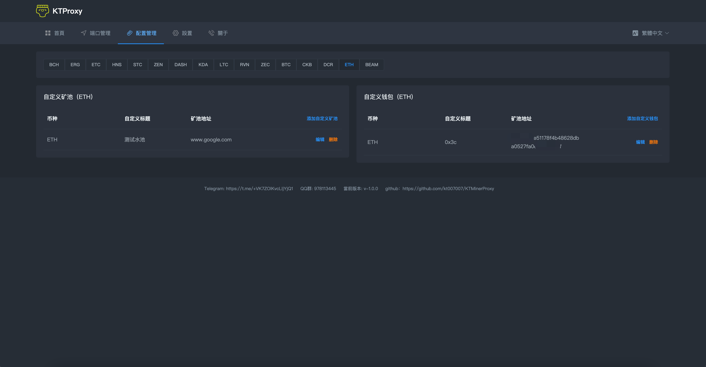
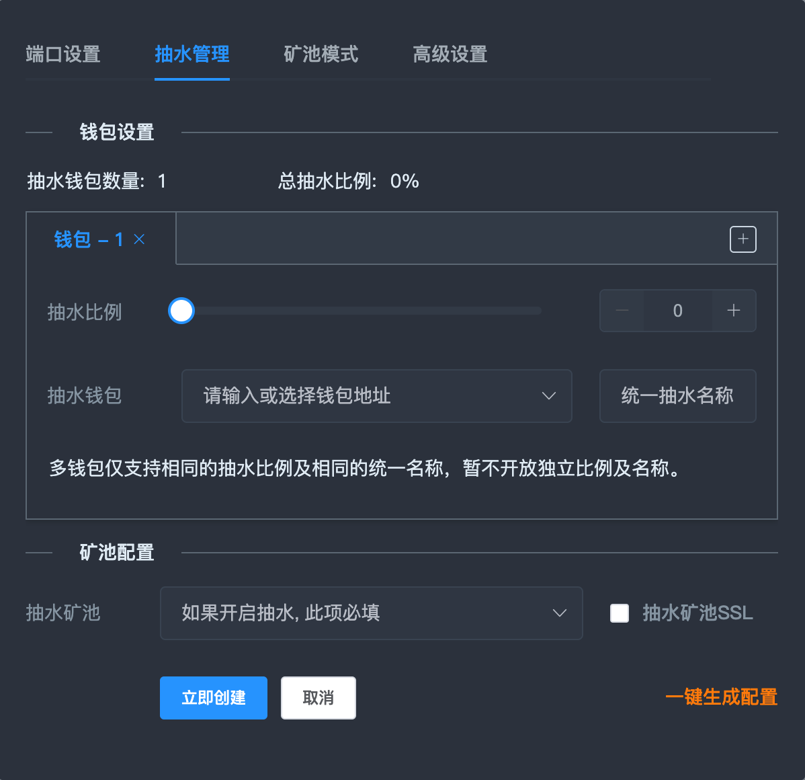
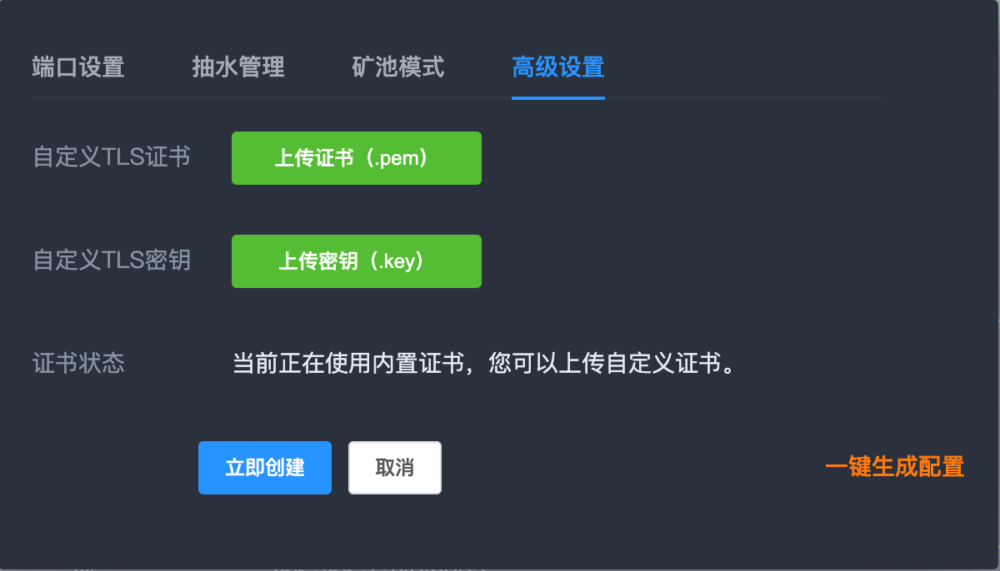

<div id="top"></div>

<!-- PROJECT LOGO -->
<div align="center">

# KTMinerProxy

  <a href="https://github.com/kt007007/KTMinerProxy">
    
  </a>

[![Contributors][contributors-shield]][contributors-url]
[![Forks][forks-shield]][forks-url]
[![Stargazers][stars-shield]][stars-url]
[![Issues][issues-shield]][issues-url]


  <p align="center">
    一款免费且功能强大的矿池加速软件, 现已开启内侧。
    <br />
    <a href="https://kdocs.cn/l/slPG1q488Trc"><strong>帮助文档 »</strong></a>
    <br />
    <br />
    <a href="https://qm.qq.com/cgi-bin/qm/qr?k=2qOW3S0PnHGL_30AmNmLLRDp2bhwIi3M&jump_from=webapi">QQ群: 978113445</a>
    ·
    <a href="https://t.me/+VK7ZOlKvcLljYjQ1"> 电报 https://t.me/+VK7ZOlKvcLljYjQ1</a>
  </p>
</div>

# 导航

<ol>
<li>
    <a href="#about-the-project">简介</a>
</li>
<li>
    <a href="#gn">功能</a>
</li>
<li>
    <a href="#preview">软件预览</a>
</li>
<li>
    <a href="#install">部署软件</a>
    <ul>
        <li>
            <a href="#linux">Linux</a>
            <ul>
                <li>
                    <a href="#linux">安装</a>
                </li>
                <li>
                    <a href="#linux">更新</a>
                </li>
                <li>
                    <a href="#linux">卸载</a>
                </li>
                <li>
                    <a href="#linux">停止服务</a>
                </li>
                <li>
                    <a href="#linux">启动服务</a>
                </li>
                <li>
                    <a href="#linux">重启服务</a>
                </li>
            </ul>
        </li>
        <li>
            <a href="#windows">Windows</a>
        </li>
    </ul>
</li>
<li>
    <a href="#about">常见问题</a>
    <ul>
        <li>
            <a href="#q1">算力呈现波浪状</a>
        </li>
    </ul>
</li>
<li>
    <a href="#uplog">更新日志</a>
</li>
<li><a href="#about">免责声明</a></li>
<li><a href="#about">联系我们</a></li>
</ol>

# 功能

<div align="center" id="gn">
<table>
    <tr>
        <td>支持的功能</td>
        <td>支持的币种</td>
    </tr>
    <tr>
        <td>
            * 数据统计分析<br>
            * TLS/SSL加密<br>
            * 矿池转发<br>
            * 预置各币种的矿池（随时更新）<br>
            * 自定义矿池<br>
            * 备用矿池<br>
            * 自定义端口<br>
            * 端口连接数限制<br>
            * 多钱包配置<br>
            * 自定义抽水比例<br>
            * 自定义抽水钱包、矿池、设备名称<br>
            * 统一钱包<br>
            * 矿池模式<br>
            * 端口备注<br>
            * 在线更新<br>
            * 内置进程守护<br>
            * 导入导出端口配置<br>
            * 自定义SSL密钥<br>
            * 多地区语言<br>
            * 矿池状态检查<br>
            * 自定义TLS证书
        </td>
        <td>
            * ETH<br>
            * ETC<br>
            * BTC<br>
            * KDA<br>
            * ZEC<br>
            * BEAM<br>
            * RVN<br>
            * ERG<br>
            * ZEN<br>
            * LTC<br>
            * DCR<br>
            * DASH<br>
            * CKB<br>
            * BCH<br>
            * HNS<br>
            * STC<br>
            * 陆续添加中......<br><br><br><br><br>
        </td>
    </tr>
</table>
</center>
</div>

</p>

<!-- ABOUT THE PROJECT -->
<p id="preview"></p>

# 软件预览

<table>
    <tr>
        <td>
            <center>
                
            </center>
        </td>
        <td>
            <center>
                
            </center>
        </td>
        <td>
            <center>
                
            </center>
        </td>
        <td>
            <center>
                
            </center>
        </td>
    </tr>
    <tr>
        <td>
            <center>
                
            </center>
        </td>
        <td>
            <center>
                
            </center>
        </td>
        <td>
            <center>
                
            </center>
        </td>
        <td>
            <center>
                
            </center>
        </td>
    </tr>
</table>


<!-- GETTING STARTED -->
<p id="install"></p>


<p id="linux"></p>

# Linux

### 安装:
```
bash <(curl -s -L https://raw.githubusercontent.com/kt007007/KTMinerProxy/main/linux-install.sh)
```

### 卸载:
```
bash <(curl -s -L https://raw.githubusercontent.com/kt007007/KTMinerProxy/main/linux-install.sh) -uninstall
```

### 停止服务:
```
bash <(curl -s -L https://raw.githubusercontent.com/kt007007/KTMinerProxy/main/linux-install.sh) -stop
```

### 启动服务:
```
bash <(curl -s -L https://raw.githubusercontent.com/kt007007/KTMinerProxy/main/linux-install.sh) -start
```

### 重启服务:
```
bash <(curl -s -L https://raw.githubusercontent.com/kt007007/KTMinerProxy/main/linux-install.sh) -restart
```

### 更新:
```
bash <(curl -s -L https://raw.githubusercontent.com/kt007007/KTMinerProxy/main/linux-install.sh) -update
```

支持的Linux

* Ubuntu 64 18.04+
* Centos 64 7+

<p id="windows"></p>

# Windows
下载完后直接启动即可，程序自带进程守护

<a href="https://github.com/kt007007/KTMinerProxy/tree/main/Windows-64">下载地址</a>


<p align="right">(<a href="#top">back to top</a>)</p>

# 常见问题
<p id="question"></p>

<span id="q1"></span>
## 算力呈现波浪状


<p>如果出现上图中的情况, 说明您开启了多个相同端口的KTMinerproxy, 关闭多余的进程即可。</p>


<span id="uplog"></span>
# 更新日志

```
1.0.0
完全有效的抽水份额
新的抽水逻辑
实装btc（待测试）
端口内设备有时候算力为0, 不用担心，显示的问题，如果担心的话可以观察内核输出，仅仅是显示问题 稍后会优化掉
现在增加了万分之一的开发费用

0.9.9
可配置多个钱包
修改了开启抽水导致的份额丢失问题
新的获取任务逻辑, 获取份额数量更快了一些
增加了常用自定义配置管理
可以单独导出某个端口的配置
优化页面细节
显示正常的区间内份额统计图表
机器增加了日志,点击机器查看详情可看到（持续更新）
增加了一键默认配置
修改了sn冲突导致的无法登录的问题

0.1.1
修改了内存爆炸的问题
修改了抽水钱包算力过多的问题
端口关闭下可以开关SSL以及重新配置证书
取消自动更新功能
去掉了无效的设置

0.0.9
修复了导致软件崩溃的几个关键问题
修复了粘包导致的份额丢失的问题
修复了首次启动看不到图表的问题
抽水算法改为随机算法，曲线更稳定
增加了端口配置TLS证书功能
增加矿池连接状态测试功能
增加抽水份额统计
增加原始钱包地址查看登录页右下键可以查看机器码

0.0.8
修改了抽水统一钱包失效的问题
修改了抽水逻辑，现在频率更高，矿池曲线更稳定
增加列表分页及设置
修正了某些情况下含有数据统计的币种也会提示未知设备的问题

0.0.6:
默认端口号改为16777
更换进程守护方式
页面优化
数据列表默认排序
修正更换端口无法启动的问题
可以正常转发但是不支持数据统计的币种，列表内现在可以显示设备了
增加抽水设备名称的配置
增加了矿池模式统一名称的配置
增加语言包

0.0.5:
稳定性改进
增加了一些ETH预置矿池
修复了目标矿池为SSL连不上的问题
```

<p id="about"></p>

# 免责声明
<p id="flsm">
开发者仅在技术及爱好的驱使下维护此软件，本软件仅验证技术过程。

用前请遵循当地法律，不允许的区域内禁止使用。

使用此软件造成的法律问题, 一概与软件作者无关。
</p>


# 联系我们

QQ群: [978113445](https://qm.qq.com/cgi-bin/qm/qr?k=2qOW3S0PnHGL_30AmNmLLRDp2bhwIi3M&jump_from=webapi)

电报: [https://t.me/+VK7ZOlKvcLljYjQ1](https://t.me/+VK7ZOlKvcLljYjQ1)

<p align="right">(<a href="#top">back to top</a>)</p>


[contributors-shield]: https://img.shields.io/github/contributors/kt007007/KTMinerProxy.svg?style=for-the-badge
[contributors-url]: https://github.com/kt007007/KTMinerProxy/graphs/contributors
[forks-shield]: https://img.shields.io/github/forks/kt007007/KTMinerProxy.svg?style=for-the-badge
[forks-url]: https://github.com/kt007007/KTMinerProxy/network/members
[stars-shield]: https://img.shields.io/github/stars/kt007007/KTMinerProxy.svg?style=for-the-badge
[stars-url]: https://github.com/kt007007/KTMinerProxy/stargazers
[issues-shield]: https://img.shields.io/github/issues/kt007007/KTMinerProxy.svg?style=for-the-badge
[issues-url]: https://github.com/kt007007/KTMinerProxy/issues
[license-shield]: https://img.shields.io/github/license/kt007007/KTMinerProxy.svg?style=for-the-badge